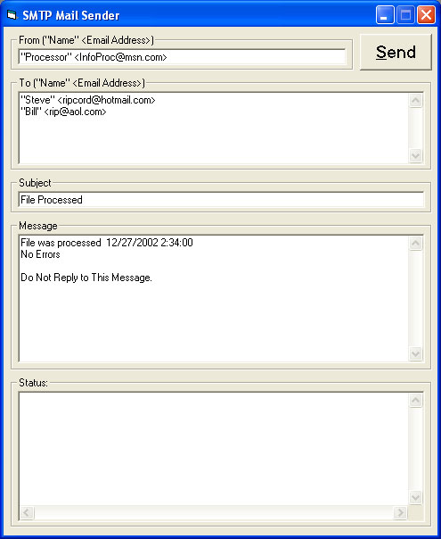



## Enhanced SMTP Emailer

### Description

Another SMTP Emailer, but this has some nice enhancements. Let's you mail to multiple addresses. Does not relay through SMTP Servers. Get's MX Records in email addresses and contacts the Mail server directly. Is event fired so there is not a lot of built in waiting and it emails to multiple address with multiple winsocks. There's some code here from several other programs on PSC. Especially the MX Record Lookup and getting the DNS server info. Thanks to all who contribute. I put this together for work I'm doing and I thought I'd pass it on to others who may need the same things. You'll notice that you can just add this form to your project and have instant ability to email by calling the exposed sub routine in the form. Look at the main sub in modMain to see how you can do this.
 
### More Info
 

             |
---                |---
**Submitted On**   |2002-12-23 13:51:30
**By**             |[Roger M\. Reeder](https://github.com/Planet-Source-Code/PSCIndex/blob/master/ByAuthor/roger-m-reeder.md)
**Level**          |Intermediate
**User Rating**    |5.0 (80 globes from 16 users)
**Compatibility**  |VB 5\.0, VB 6\.0
**Category**       |[Miscellaneous](https://github.com/Planet-Source-Code/PSCIndex/blob/master/ByCategory/miscellaneous__1-1.md)
**World**          |[Visual Basic](https://github.com/Planet-Source-Code/PSCIndex/blob/master/ByWorld/visual-basic.md)
**Archive File**   |[Enhanced\_S15175912232002\.zip](https://github.com/Planet-Source-Code/roger-m-reeder-enhanced-smtp-emailer__1-41814/archive/master.zip)

